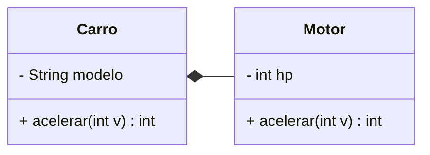
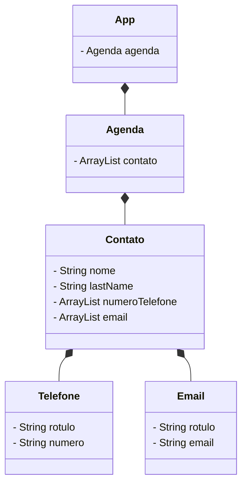

# Diagrama de classes UML

- *-- -> Significa a Composition, ou seja, caso o carro seja vendido, o motor vai junto
- o-- -> Significa a Agregação, ou seja, caso o carro seja vendido, o motor fica na garagem para ser reutilizado

- Exercicio dos slides da aula 26/04/2024, fazer apenas o UML das classes, tentando usar o máximo de classes para representar uma lista de contatos e respeitando os requisitos
